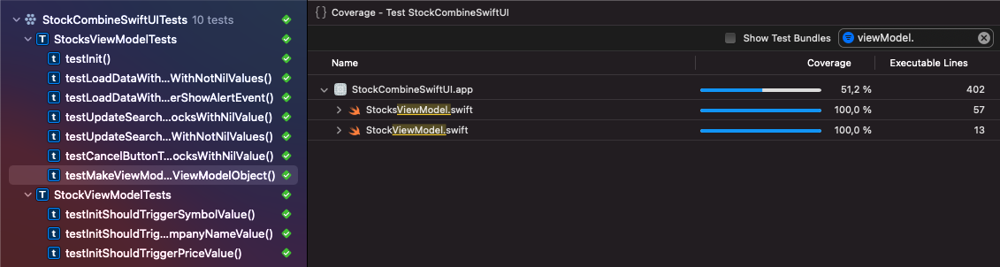

# StockCombineSwiftUI

| Light Mode                                           | Dark Mode                                          |
| ---------------------------------------------------- | -------------------------------------------------- |
|  |  |


| Unit tests                    |
| ----------------------------- |
|  |

### Initial Build Setup for iOS App

- Clone the project.
- Xcode 13 installed.
- iOS 15 or above.
- Swift Lint v0.44.0 installed.
- Open `Stocks.xcodeproj`.
- In Xcode, select a device.
- Build & Run.

### Architecture

- MVVM
- Repository Pattern
- Combine
- SwiftUI
- Protocol oriented programming

### API

- [API](https://myibd.investors.com/searchapi/predictivesearch/a/10/)

- Keys in the JSON are in the upper case. I think it should be lower case.

  ```
  // upper case key
  "Symbol": "A",
  // lower case key
  "symbol": "A",
  ```

  

